# Assemble the XY-stage 

These are more-less all components you would need for the XY-stage to operate. The Z-focus assembly is explained below

### All ingredients

<a href="#logo" name="logo">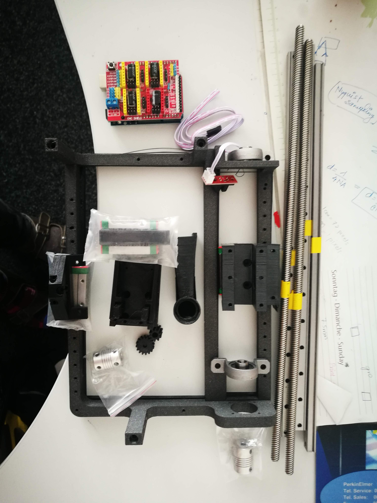</a>

### Prepare the metal parts / slides

Cut! 

<a href="#logo" name="logo">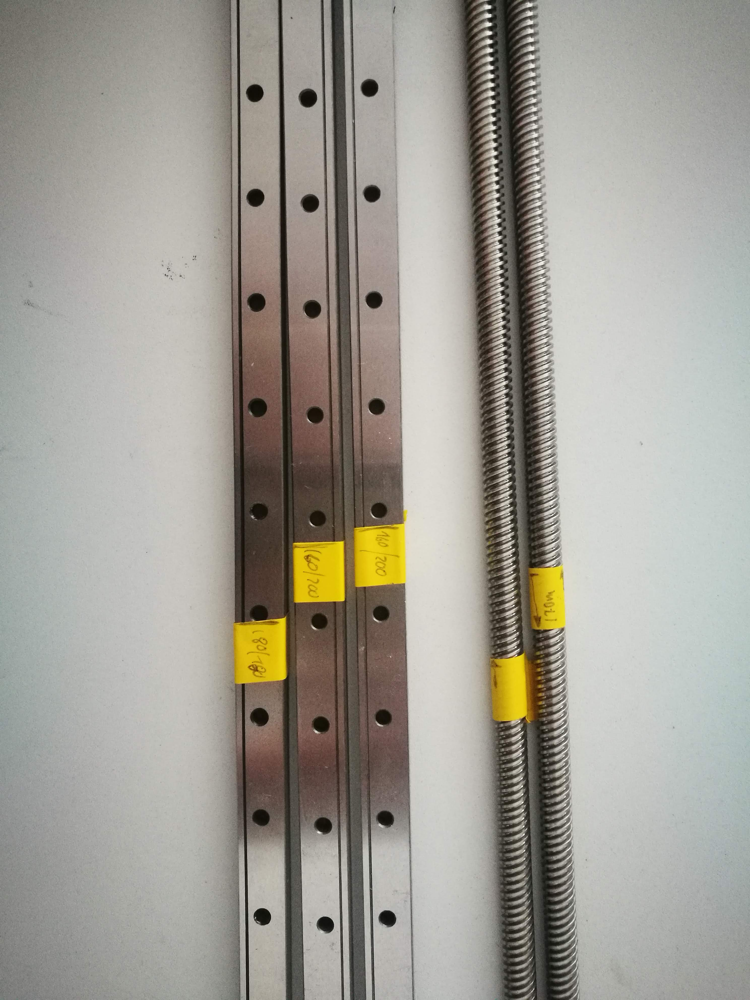</a>

### Assembling the optics module

<a href="#logo" name="logo">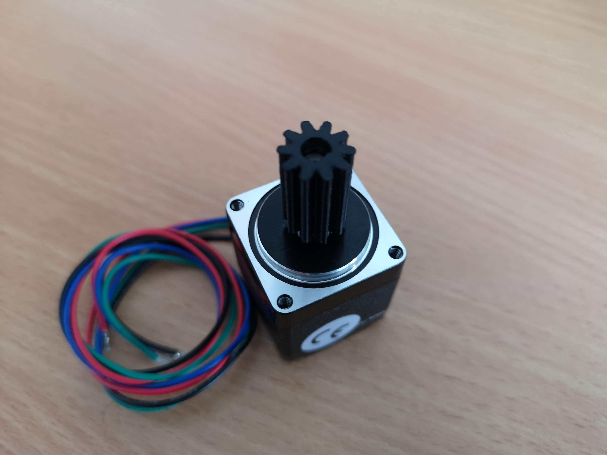</a>

<a href="#logo" name="logo">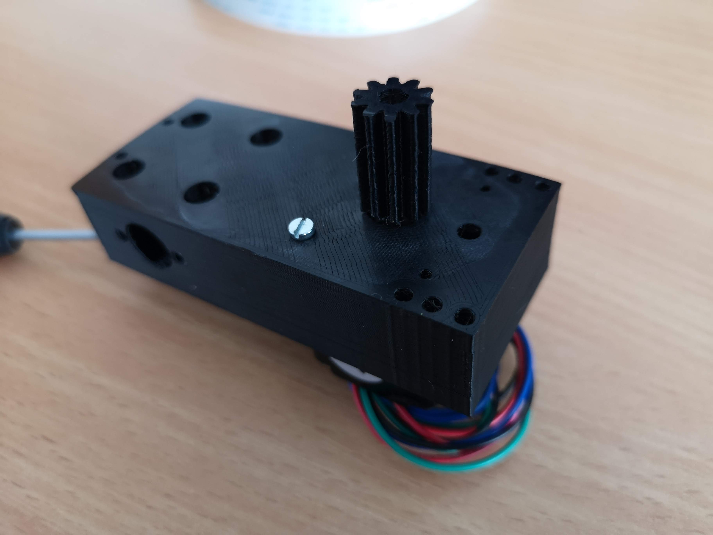</a>

<a href="#logo" name="logo">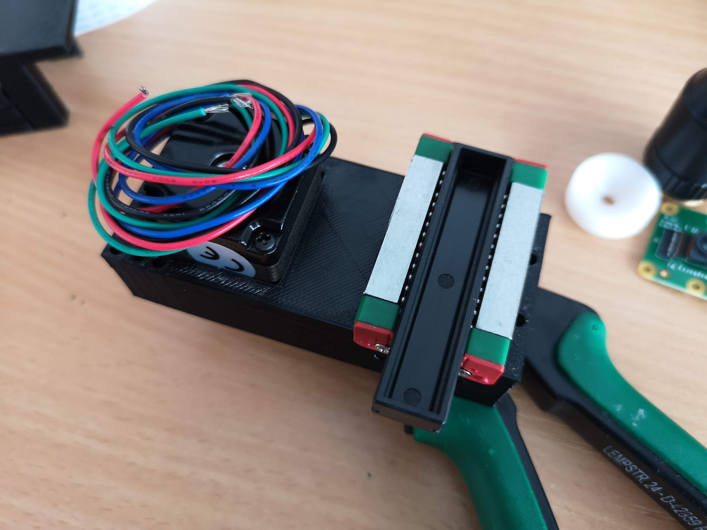</a>

<a href="#logo" name="logo">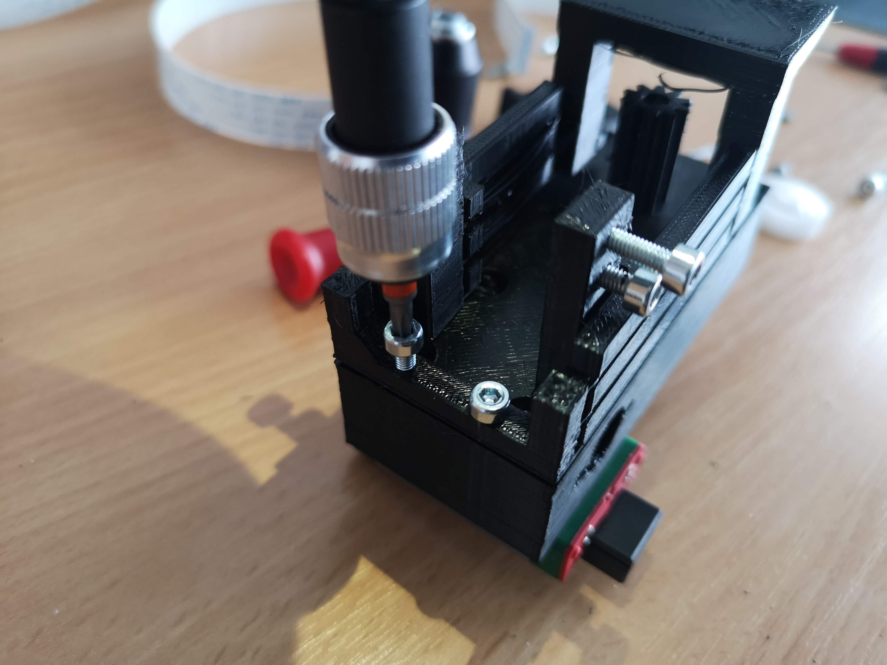</a>

### Assembling the X-slide 

<a href="#logo" name="logo">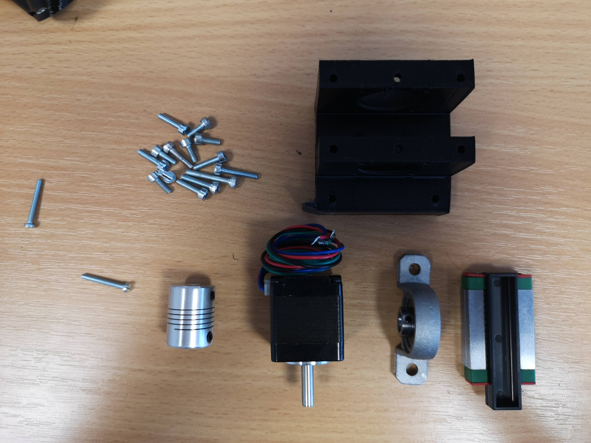</a>

<a href="#logo" name="logo">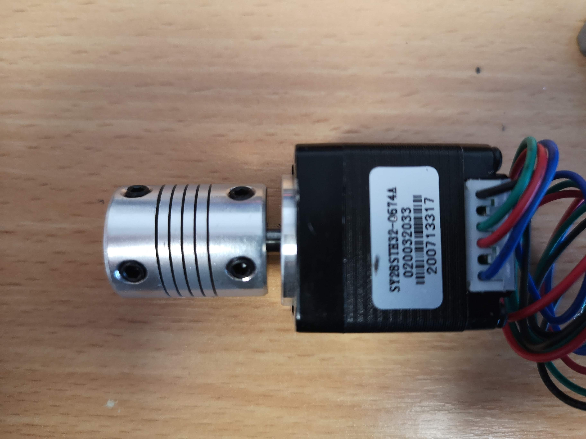</a>

### Assembling the XY Base

<a href="#logo" name="logo">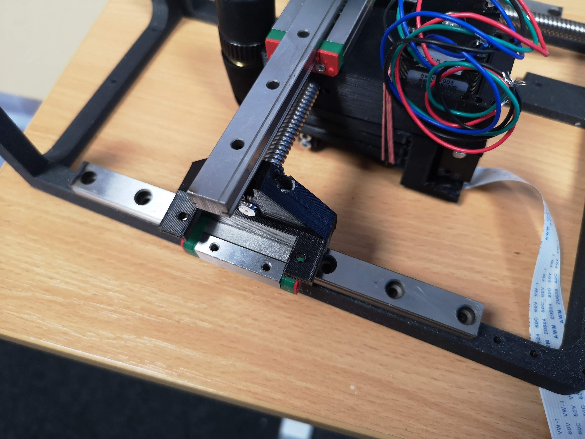</a>

<a href="#logo" name="logo">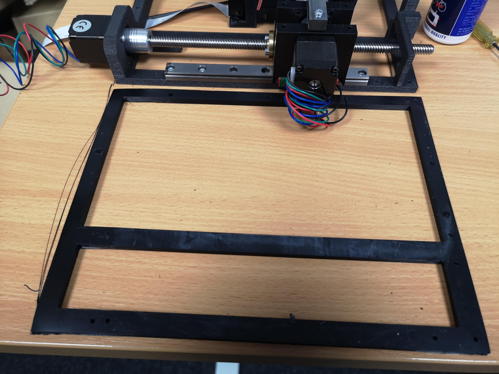</a>

<a href="#logo" name="logo">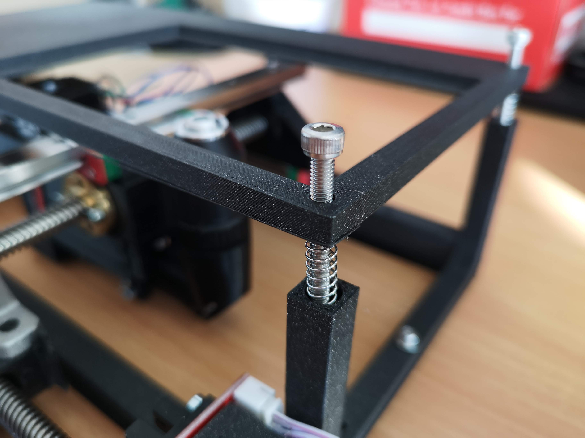</a>

### Assembling Electronics

### Finalization 

