### Assemble the XY-stage 

These are more-less all components you would need for the XY-stage to operate. The Z-focus assembly is explained below

Insert the linear Bearings (e.g. IGUS Drylin). If your printer adds to much extra air you can make the bearings larger by using some tape such that they fit in the wholes very very stiff. You can use 2 per hole. Mount the metal washer for the spindel drive. 

The "imaging unit" which has the raspberry pi camera, the CCTV lens and the focusing mechanism will be explained in a dedicated tutorial below. 

In case the holes for the 6mm rods are not large enough widen them a bit with e.g. a screwdriver. 

Same with the holes for the motor

Add the clutch to the the stepper motor (NEMA 11) and mount on to the Baseplate as such:

<a href="#logo" name="logo">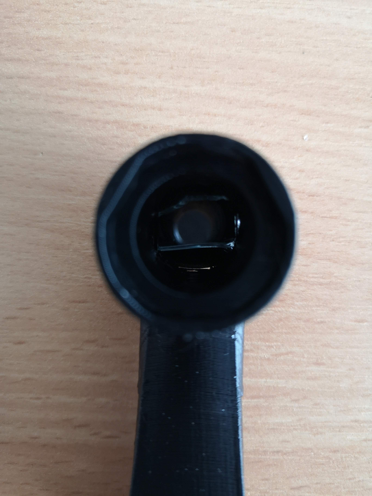</a>

<a href="#logo" name="logo">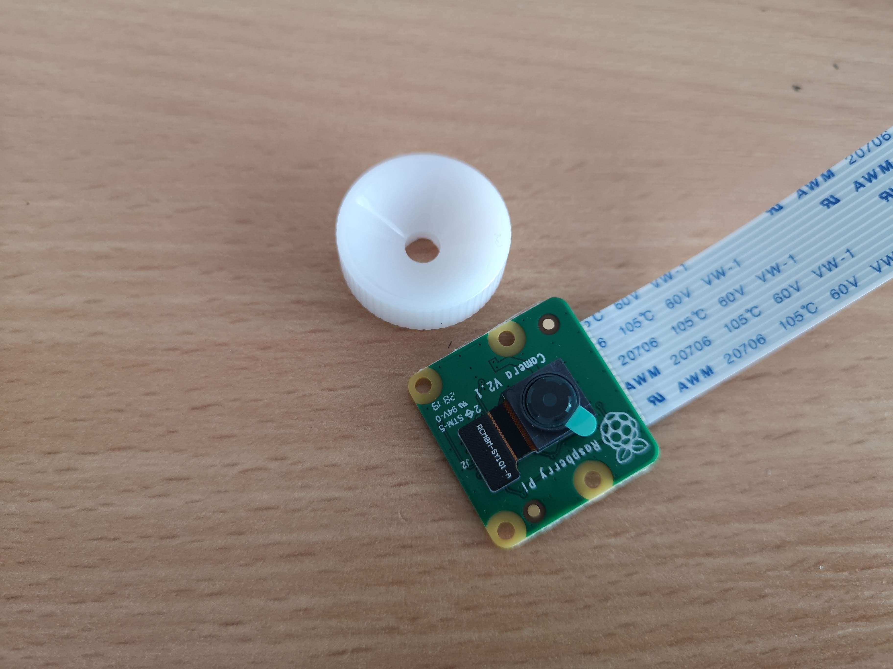</a>

<a href="#logo" name="logo">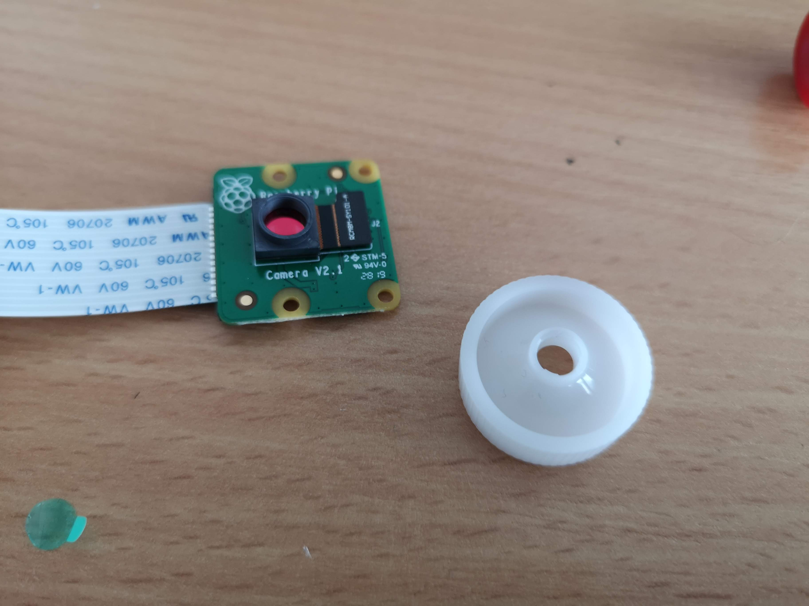</a>

<a href="#logo" name="logo">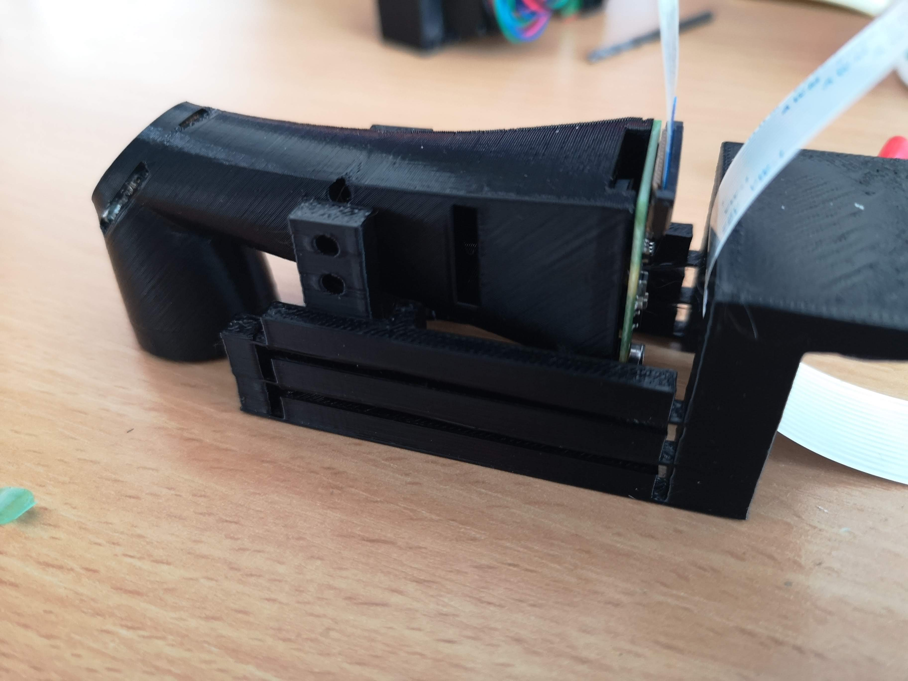</a>

<a href="#logo" name="logo">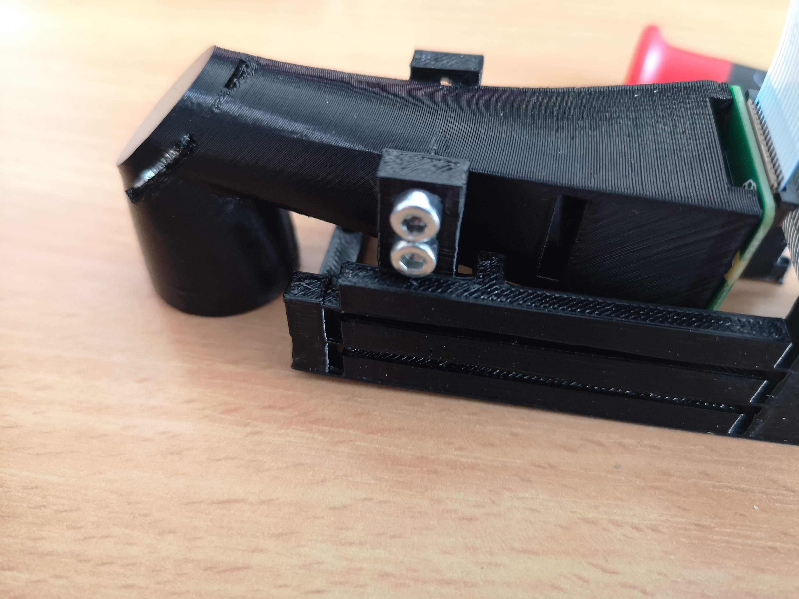</a>

<a href="#logo" name="logo">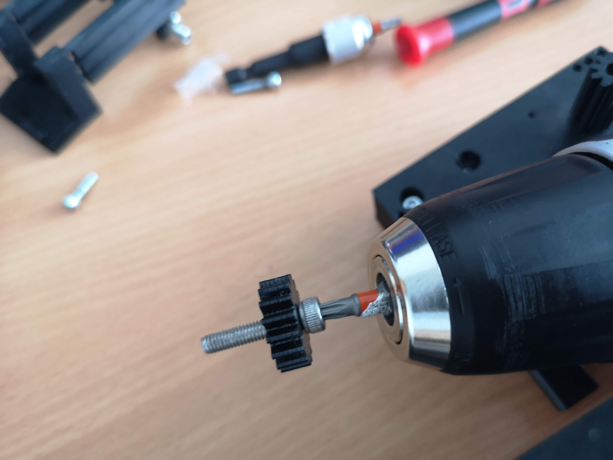</a>

<a href="#logo" name="logo">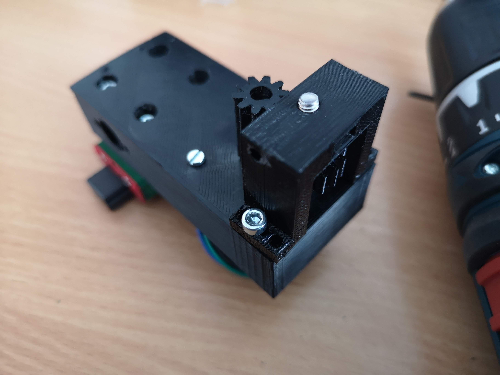</a>

<a href="#logo" name="logo">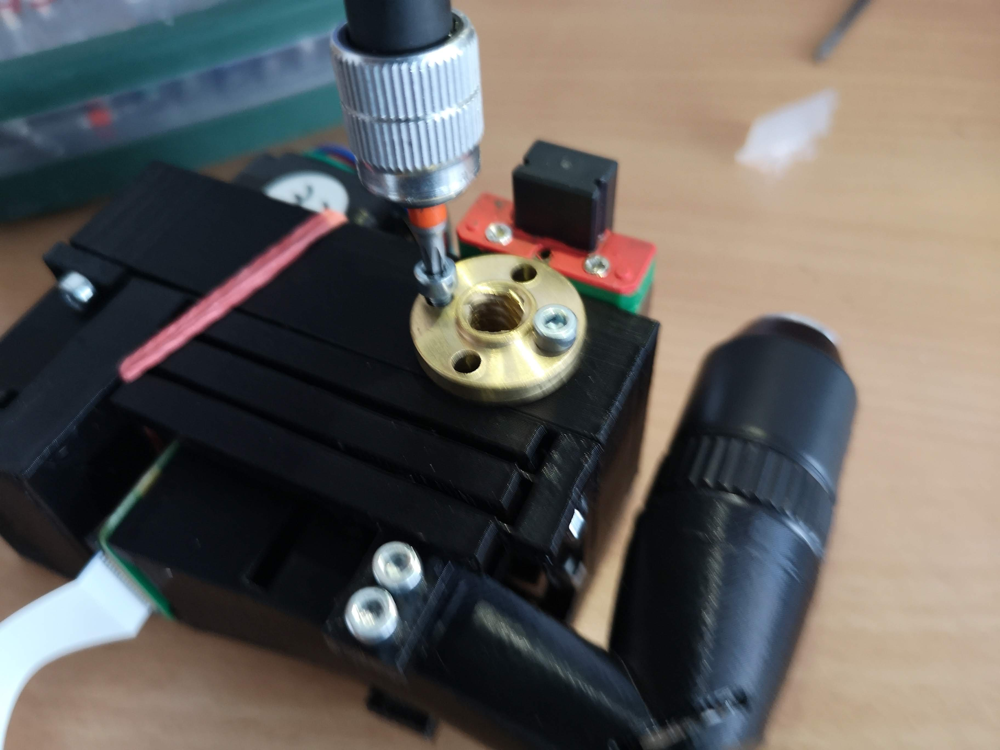</a>

<a href="#logo" name="logo">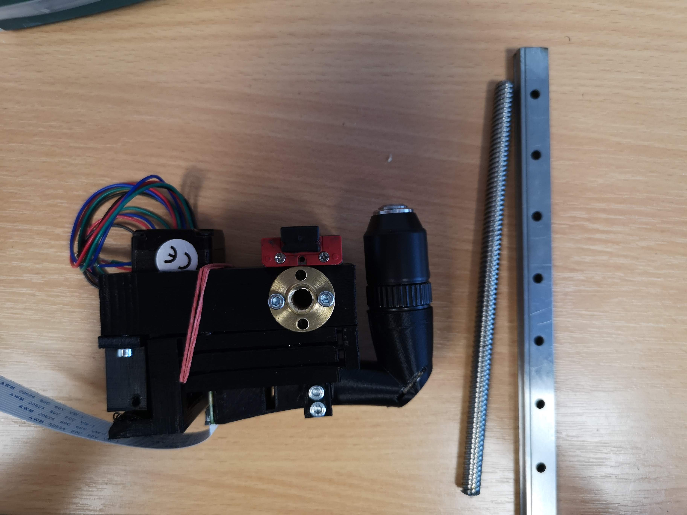</a>

<a href="#logo" name="logo">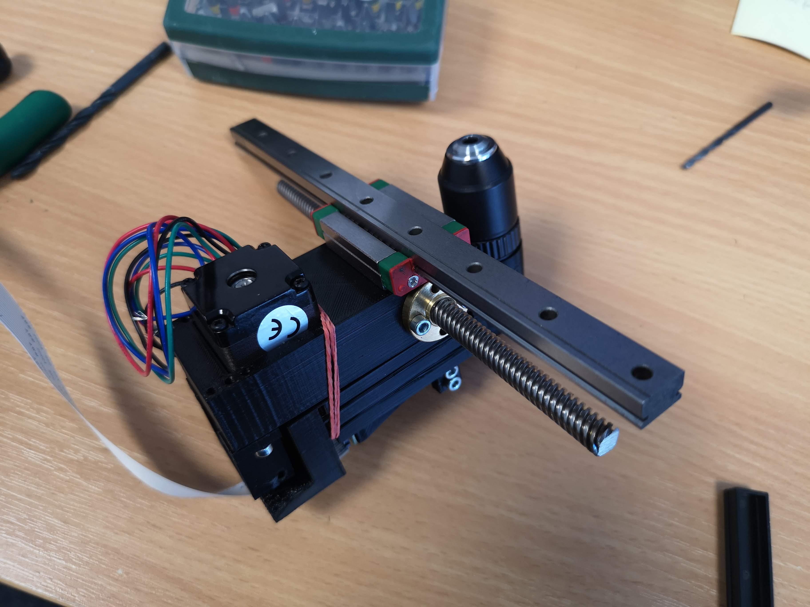</a>

### Build the voicecoil motor (VCM) driven focusing unit 

<a href="#logo" name="logo">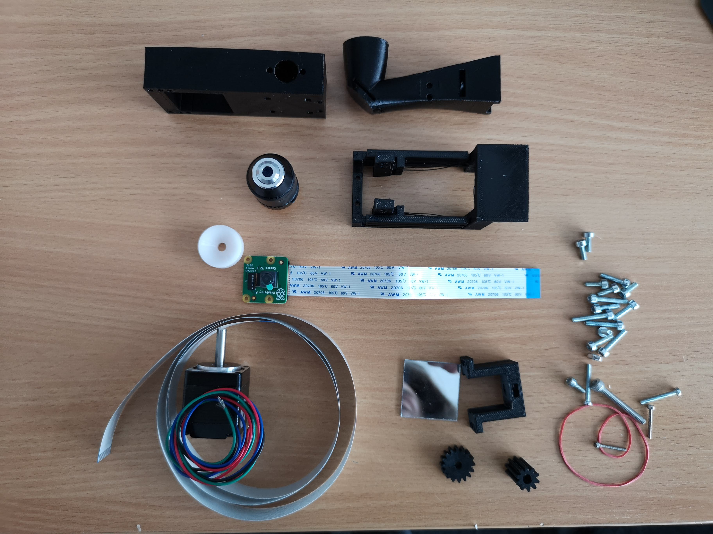</a>

